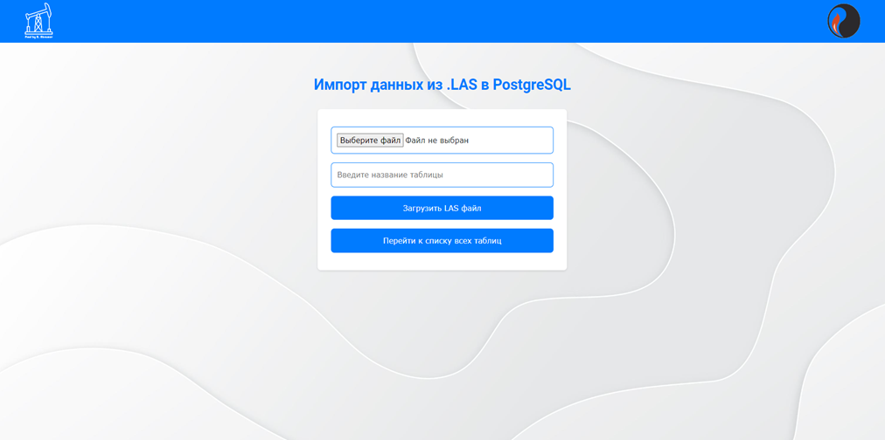
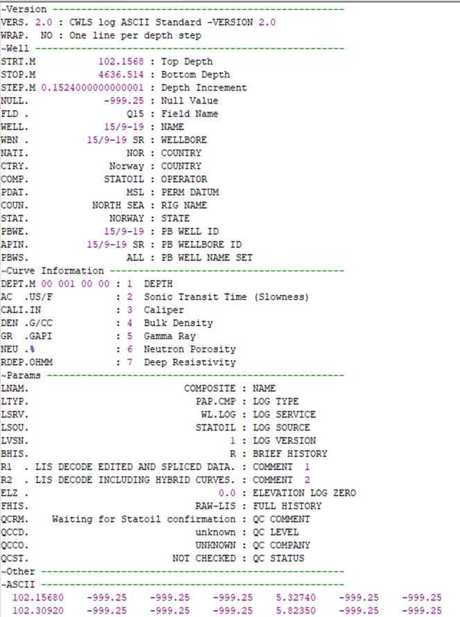
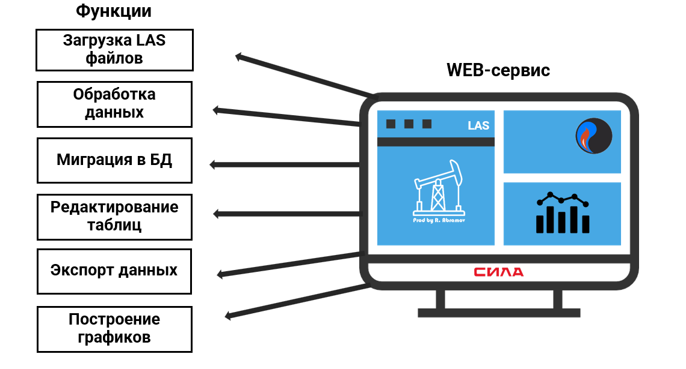

# LAS file migration

  

## Оглавление

- [Описание](#описание)
- [LAS формат](#LASформат)
- [Стек технологий](#Стек-технологий)
- [Функции WEB-сервиса](#Функции-WEB-сервиса)
- [UX/UI дизайн](#UX/UI-дизайн)
- [Реализация управления таблицами в базе данных](#реализация-управления-таблицами-в-базе-данных)
- [Экспорт данных](#экспорт-данных)
- [Скриншоты](#скриншоты)
- [Контейнизация с Docker](#контейнеризация-с-docker)

## Описание
Работа выполнена в рамках бакалаврской дипломной работы по теме: "Создание WEB-сервиса для миграции данных c использованием программ для электронных таблиц и СУБД".

Актуальность темы заключается в том, что WEB-сервис может быть использован в различных компаниях, занимающихся обработкой и анализом геофизических данных.
Внедрение такого инструмента позволит значительно сократить время и усилия, затрачиваемые на миграцию данных, повысить качество и точность анализа,
а также обеспечить интеграцию данных с другими информационными системами.

## LAS формат
LAS (Log ASCII Standard) файл — формат файла, используемый в нефтяной и газовой промышленности для хранения данных каротажных исследований скважин.
Данный формат основан в виде ASCII, то есть обычного текста, поэтому файлы могут быть открыты в любом, даже самом простом, текстовом редакторе.

В данный формат включаются следующие секции:
- `~V: секция «Version»`: обозначение версии файла LAS;
- `~W: секция «Well»`: перечисление идентификаторов скважины;
- `~C: секция «Curve»`: описывание кривых;
- `~P: секция «Parameters»`: описание параметров скважины;
- `~A: Секция «ASCII log data»`: хранение информации по кривым.

Пример LAS файла: 

  

## Стек технологий

- Python 
- Django
- PostgreSQL
- HTML
- CSS
- JavaScript
- Figma
- Xlsx, TXT, JSON (в качестве экспорта данных)

## Функции WEB-сервиса
Основные функции WEB-сервиса:

  

## UX/UI дизайн
На стадии проектирования дизайн включал в себя семь основных элементов: 
- Главная страница
- Список таблиц
- Вывод таблицы
- График
- Подтверждение об успешном добавлении данных
- Изменение названия таблицы
- Подтверждение удаления

Немаловажным аспектом является создание связей между фреймами.
Они обеспечивают логичную и интуитивно понятную навигацию по WEB-сервису:

  

