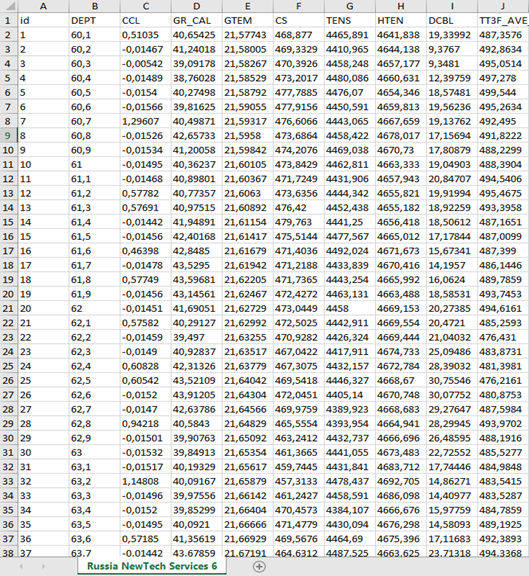
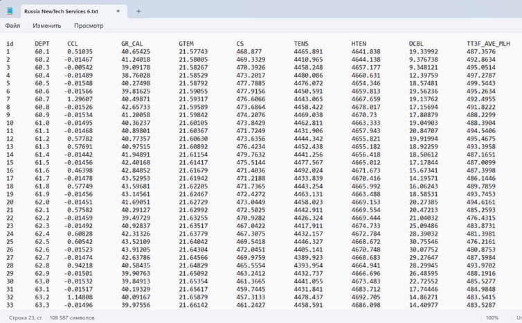
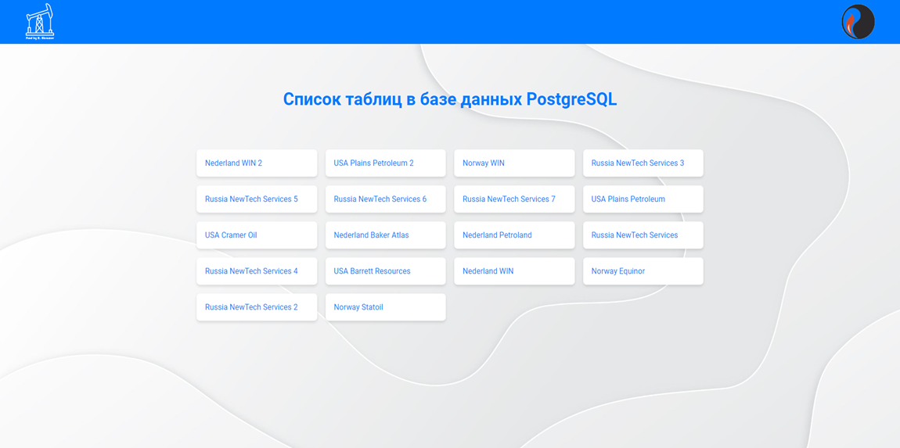
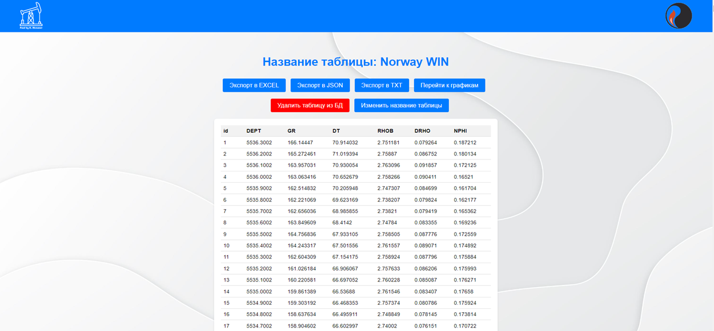
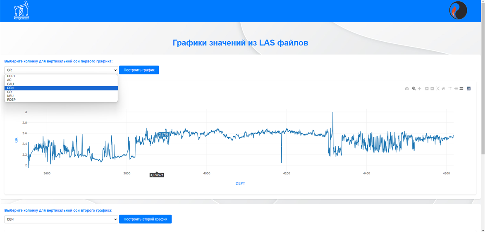
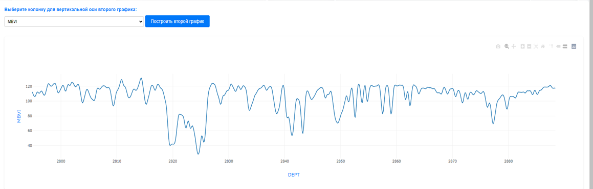
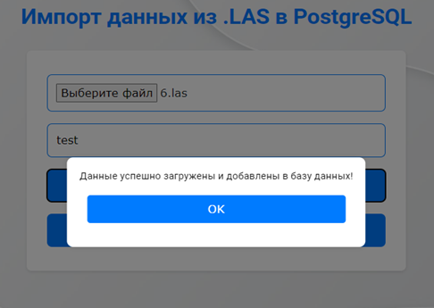
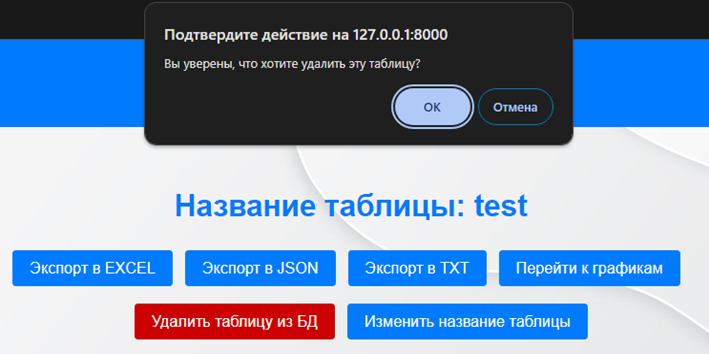
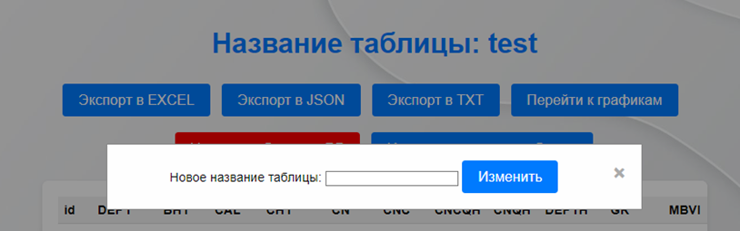

# LAS file migration

<p align="center">
  
</p>

## Оглавление

- [Описание](#описание)
- [LAS формат](#las-формат)
- [Стек технологий](#cтек-технологий)
- [Функции WEB-сервиса](#функции-WEB-сервиса)
- [UX/UI дизайн](#ux/ui-дизайн)
- [Реализация управления таблицами в базе данных](#реализация-управления-таблицами-в-базе-данных)
- [Экспорт данных](#экспорт-данных)
- [Скриншоты](#скриншоты)
- [Контейнеризация с Docker](#контейнеризация-с-docker)
- [Заключение](#заключение)


## Описание

Работа выполнена в рамках бакалаврской дипломной работы по теме: "Создание WEB-сервиса для миграции данных c использованием программ для электронных таблиц и СУБД".

Актуальность темы заключается в том, что WEB-сервис может быть использован в различных компаниях, занимающихся обработкой и анализом геофизических данных.
Внедрение такого инструмента позволит значительно сократить время и усилия, затрачиваемые на миграцию данных, повысить качество и точность анализа,
а также обеспечить интеграцию данных с другими информационными системами.

## LAS формат

LAS (Log ASCII Standard) файл — формат файла, используемый в нефтяной и газовой промышленности для хранения данных каротажных исследований скважин.
Данный формат основан в виде ASCII, то есть обычного текста, поэтому файлы могут быть открыты в любом, даже самом простом, текстовом редакторе.

В данный формат включаются следующие секции:
- `~V: секция «Version»`: обозначение версии файла LAS;
- `~W: секция «Well»`: перечисление идентификаторов скважины;
- `~C: секция «Curve»`: описывание кривых;
- `~P: секция «Parameters»`: описание параметров скважины;
- `~A: Секция «ASCII log data»`: хранение информации по кривым.

Пример LAS файла: 
<p align="center">
  
</p>


## Стек технологий

- Python 
- Django
- PostgreSQL
- HTML
- CSS
- JavaScript
- Figma
- Xlsx, TXT, JSON (в качестве экспорта данных)

## Функции WEB-сервиса
Основные функции WEB-сервиса:
<p align="center">
  
</p>


## UX/UI дизайн

На стадии проектирования дизайн включал в себя семь основных элементов: 
- Главная страница
- Список таблиц
- Вывод таблицы
- График
- Подтверждение об успешном добавлении данных
- Изменение названия таблицы
- Подтверждение удаления

Немаловажным аспектом является создание связей между фреймами.
Они обеспечивают логичную и интуитивно понятную навигацию по WEB-сервису:
<p align="center">
  
</p>


## Реализация управления таблицами в базе данных

Для отображения списка таблиц используется функция list_tables. Она отвечает за получение списка всех таблиц, находящихся в базе данных,
за исключением системных и служебных таблиц Django. Для этого используется SQL-запрос к информации схемы базы данных.

Функция list_tables:
```python
def list_tables(request):
    excluded_tables = [
        'django_migrations',
        'django_content_type',
        'auth_permission',
        'auth_group',
        'auth_group_permissions',
        'auth_user',
        'auth_user_groups',
        'auth_user_user_permissions',
        'django_admin_log',
        'django_session'
    ]

    cursor = connection.cursor()
    cursor.execute("SELECT table_name FROM information_schema.tables WHERE table_schema = 'public'")
    tables = [row[0] for row in cursor.fetchall() if row[0] not in excluded_tables]
    cursor.close()

    return render(request, 'list_tables.html', {'tables': tables})
```
Для отображения содержимого таблицы используется функция table_view.
Эта функция выполняет SQL-запрос для получения всех данных из указанной таблицы и передает их в HTML шаблон.

Функция table_view:
```python
def table_view(request, table_name):
    cursor = connection.cursor()
    cursor.execute("SELECT * FROM \"{}\"".format(table_name))
    rows = cursor.fetchall()
    column_names = [desc[0] for desc in cursor.description]
    cursor.close()
    return render(request, 'table_view.html',
                  {'table_name': table_name,
                   'column_names': column_names, 'rows': rows})
```
Для переименования таблицы используется функция rename_table. Эта функция также обрабатывает POST-запрос и выполняет SQL-команду для переименования.
Функция принимает старое и новое имя таблицы и выполняет команду ALTER TABLE для переименования.

Функция rename_table:
```python
def rename_table(request):
    if request.method == 'POST':
        old_table_name = request.POST.get('old_table_name')
        new_table_name = request.POST.get('new_table_name')

        cursor = connection.cursor()
        cursor.execute("ALTER TABLE {} RENAME TO {}".
                       format(connection.ops.quote_name(old_table_name),
                              connection.ops.quote_name(new_table_name)))
        cursor.close()

        return HttpResponseRedirect(reverse('list_tables'))
```
Для удаления таблицы используется функция delete_table. 
Эта функция обрабатывает POST-запрос, выполняет SQL-команду для удаления указанной таблицы и перенаправляет пользователя на страницу со списком таблиц.

Функция delete_table:
```python
def delete_table(request):
    if request.method == 'POST':
        table_name = request.POST.get('table_name')
        cursor = connection.cursor()
        cursor.execute("DROP TABLE IF EXISTS {}"
                       .format(connection.ops.quote_name(table_name)))
        cursor.close()
        return HttpResponseRedirect(reverse('list_tables'))
```


## Экспорт данных

Для экспорта данных в формат Excel используется функция export_to_excel.
Эта функция принимает имя таблицы в качестве входного параметра, выполняет SQL-запрос для получения данных из указанной таблицы и формирует файл Excel.

Функция export_to_excel:
```python
def export_to_excel(request):
    if request.method == 'POST':
        table_name = request.POST.get('table_name')
        with connection.cursor() as cursor:
            cursor.execute("SELECT * FROM {}".format(connection.ops.quote_name(table_name)))
            rows = cursor.fetchall()

        wb = openpyxl.Workbook()
        ws = wb.active
        ws.title = table_name

        columns = [desc[0] for desc in cursor.description]
        ws.append(columns)

        for row in rows:
            ws.append(row)

        response = HttpResponse(content_type='application/vnd.openxmlformats-officedocument.spreadsheetml.sheet')
        response['Content-Disposition'] = f'attachment; filename="{table_name}.xlsx"'
        wb.save(response)
        return response
    else:
        return HttpResponse('Ошибка при экспорте', status=405)
```

Для экспорта данных в формат JSON используется функция export_to_json. 
Эта функция аналогична предыдущей, за исключением того, что она формирует файл JSON с данными из базы данных.

Функция export_to_json:
```python
def export_to_json(request):
    if request.method == 'POST':
        table_name = request.POST.get('table_name')
        with connection.cursor() as cursor:
            cursor.execute("SELECT * FROM {}".format(connection.ops.quote_name(table_name)))
            rows = cursor.fetchall()

        def decimal_default(obj):
            if isinstance(obj, Decimal):
                return str(obj)
            raise TypeError

        data = [dict(zip([column[0] for column in cursor.description], row)) for row in rows]
        json_data = json.dumps(data, indent=4, default=decimal_default)

        response = HttpResponse(json_data, content_type='application/json')
        response['Content-Disposition'] = f'attachment; filename="{table_name}.json"'
        return response
    else:
        return render(request, 'error.html', {'message': 'Метод не поддерживается'})
```

Для экспорта данных в текстовый формат используется функция export_to_txt.
Она аналогична предыдущим функциям, но формирует txt файл с использованием табуляции.
```python
def export_to_txt(request):
    if request.method == 'POST':
        table_name = request.POST.get('table_name')
        with connection.cursor() as cursor:
            cursor.execute("SELECT * FROM {}".format(connection.ops.quote_name(table_name)))
            rows = cursor.fetchall()

        data = '\n'.join(['\t'.join(map(str, row)) for row in rows])

        response = HttpResponse(data, content_type='text/plain')
        response['Content-Disposition'] = f'attachment; filename="{table_name}.txt"'
        return response
    else:
        return render(request, 'error.html', {'message': 'Ошибка при экспорте'})
```


Пример экспортированных файлов:
<p align="center">
  <table>
    <tr>
      <td></td>
      <td></td>
      <td></td>
    </tr>
  </table>
</p>


## Скриншоты

<p align="center">
  
  
  
  
  
</p>
<p align="center">
  <table>
    <tr>
      <td></td>
      <td></td>
    </tr>
  </table>
</p>
<p align="center">
  <table>
    <tr>
      <td></td>
      <td></td>
    </tr>
  </table>
</p>


## Контейнеризация с Docker

Для развертывания моего Django приложения на Docker я создал три контейнера. 
Первый контейнер использует образ Python и выполняет Django приложение. 
Второй контейнер использует образ PostgreSQL. 
Третий контейнер, использующий образ nginx,  он служит обратным прокси-сервером для обработки входящих HTTP-запросов и перенаправления их на контейнер с Django приложением.


## Заключение

Ожидается, что результаты дипломной работы будут полезны для организаций и специалистов, которые занимаются обработкой данных в LAS формате,
предоставляя им возможность использовать данный инструмент для повышения эффективности процесса миграции данных.
